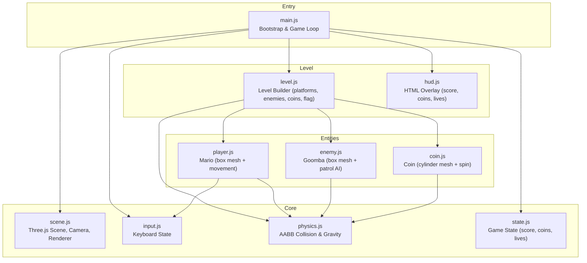
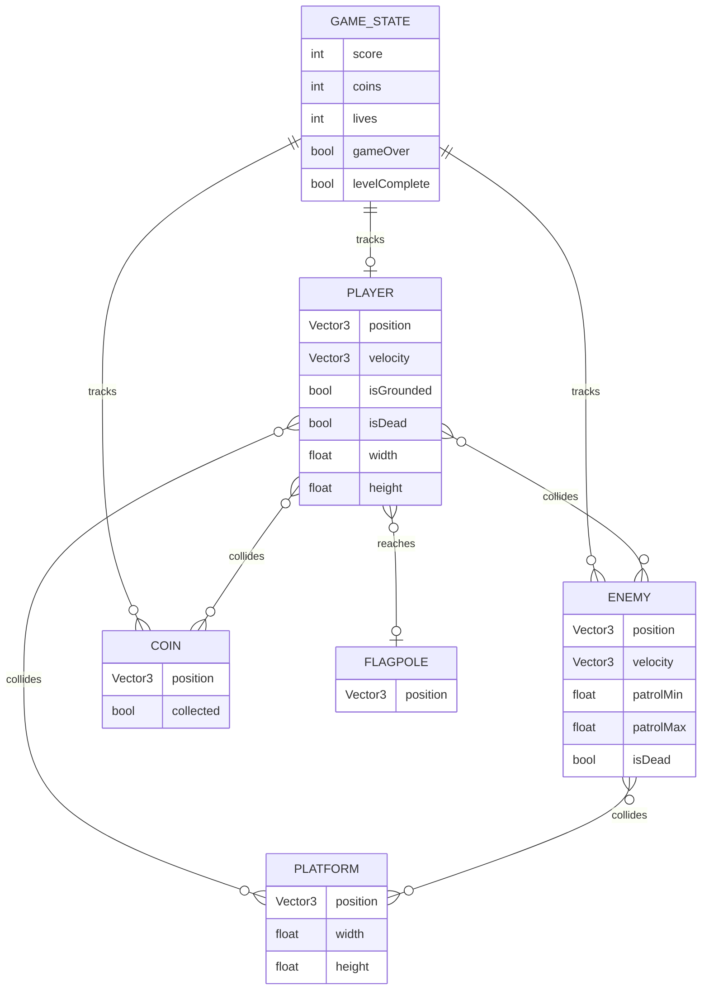
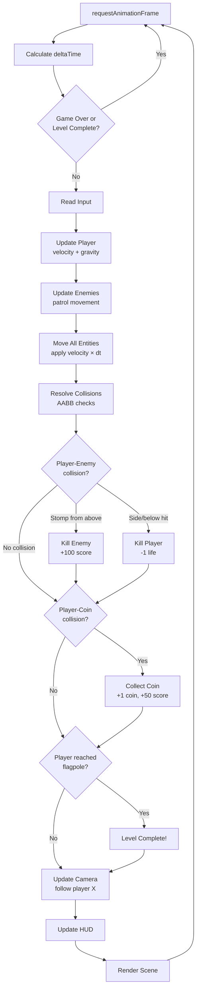

# Super Mario NES-Style 3D Platformer — Implementation Plan

## Overview

Build a 2.5D side-scrolling platformer inspired by Super Mario Bros (NES) using Three.js with geometric primitives. The player runs and jumps through a single level containing platforms, gaps, Goomba enemies, collectible coins, and a flagpole finish. The game uses 3D box/sphere/cylinder meshes viewed from a fixed side-on camera to create the classic 2D gameplay with a 3D visual style.

## Technical Context

- **Engine:** Three.js v0.183.2 (already installed)
- **Bundler:** Vite v7.3.1 with HMR
- **Entry point:** `index.html` → `src/main.js` (ES modules)
- **Art:** No textures or assets — all visuals are colored `MeshStandardMaterial` on primitive geometries
- **Physics:** Custom AABB collision detection (no physics library — keeps it simple and NES-authentic)
- **Codebase:** Currently empty (`src/main.js` has a placeholder comment)

## Architecture Diagram



## Entity Relationship Diagram



## Game Loop Flow



---

## Implementation Phases

### Phase 1: Scene Setup & Renderer

**Goal:** Get a Three.js scene rendering with a fixed orthographic-style camera looking at the side of the world, plus a ground plane and basic lighting.

**Files to create/modify:**

- `src/scene.js` — Scene, camera, renderer, lighting factory
- `src/main.js` — Bootstrap and `requestAnimationFrame` loop

**Code examples:**

```js
// src/scene.js
import * as THREE from 'three';

export function createScene(canvas) {
  const scene = new THREE.Scene();
  scene.background = new THREE.Color(0x5c94fc); // NES sky blue

  // Orthographic camera for 2.5D look — 16 units wide (NES aspect ratio feel)
  const viewWidth = 24;
  const aspect = window.innerWidth / window.innerHeight;
  const viewHeight = viewWidth / aspect;
  const camera = new THREE.OrthographicCamera(
    -viewWidth / 2, viewWidth / 2,
    viewHeight / 2, -viewHeight / 2,
    0.1, 100
  );
  camera.position.set(0, 5, 20);
  camera.lookAt(0, 5, 0);

  const renderer = new THREE.WebGLRenderer({ antialias: true });
  renderer.setSize(window.innerWidth, window.innerHeight);
  renderer.setPixelRatio(window.devicePixelRatio);
  document.body.appendChild(renderer.domElement);

  // Lighting
  const ambient = new THREE.AmbientLight(0xffffff, 0.6);
  scene.add(ambient);
  const directional = new THREE.DirectionalLight(0xffffff, 0.8);
  directional.position.set(10, 20, 10);
  scene.add(directional);

  return { scene, camera, renderer };
}
```

```js
// src/main.js
import { createScene } from './scene.js';

const { scene, camera, renderer } = createScene();

let lastTime = 0;
function gameLoop(time) {
  requestAnimationFrame(gameLoop);
  const dt = Math.min((time - lastTime) / 1000, 0.05); // cap at 50ms
  lastTime = time;

  // update() calls will go here

  renderer.render(scene, camera);
}
requestAnimationFrame(gameLoop);
```

**Acceptance criteria:**
- [ ] Running `npm run dev` shows a window with NES sky-blue background
- [ ] Scene contains ambient + directional lighting
- [ ] Orthographic camera is positioned for side-view (Z-axis pointing at viewer)
- [ ] Window resize updates camera and renderer size
- [ ] Game loop runs at 60fps with capped delta time

---

### Phase 2: Input System

**Goal:** Track keyboard state so other systems can query `isDown('ArrowLeft')` without dealing with events directly.

**Files to create:**

- `src/input.js` — Keyboard state manager

**Code examples:**

```js
// src/input.js
const keys = {};

window.addEventListener('keydown', (e) => { keys[e.code] = true; });
window.addEventListener('keyup', (e) => { keys[e.code] = false; });

export function isDown(code) {
  return !!keys[code];
}

export function isJump() {
  return isDown('Space') || isDown('ArrowUp');
}

export function horizontalAxis() {
  return (isDown('ArrowRight') ? 1 : 0) - (isDown('ArrowLeft') ? 1 : 0);
}
```

**Acceptance criteria:**
- [ ] `horizontalAxis()` returns -1, 0, or 1 based on arrow keys
- [ ] `isJump()` returns true when Space or ArrowUp is pressed
- [ ] No key repeat issues — holding a key doesn't flicker

---

### Phase 3: Player Entity

**Goal:** A red box (Mario) that runs left/right and jumps. Gravity pulls it down. It stands on the ground.

**Files to create:**

- `src/player.js` — Player mesh, movement, gravity

**Code examples:**

```js
// src/player.js
import * as THREE from 'three';
import { isJump, horizontalAxis } from './input.js';

const MOVE_SPEED = 8;
const JUMP_FORCE = 14;
const GRAVITY = -35;

export function createPlayer(scene) {
  // Mario: red body (1×1.5×1 box)
  const geometry = new THREE.BoxGeometry(0.8, 1.2, 0.8);
  const material = new THREE.MeshStandardMaterial({ color: 0xe52521 }); // Mario red
  const mesh = new THREE.Mesh(geometry, material);
  mesh.position.set(2, 2, 0);
  scene.add(mesh);

  const player = {
    mesh,
    velocity: new THREE.Vector3(0, 0, 0),
    width: 0.8,
    height: 1.2,
    isGrounded: false,
    isDead: false,
  };

  return player;
}

export function updatePlayer(player, dt) {
  if (player.isDead) return;

  // Horizontal movement
  const dir = horizontalAxis();
  player.velocity.x = dir * MOVE_SPEED;

  // Jump (only when grounded)
  if (isJump() && player.isGrounded) {
    player.velocity.y = JUMP_FORCE;
    player.isGrounded = false;
  }

  // Gravity
  player.velocity.y += GRAVITY * dt;

  // Apply velocity
  player.mesh.position.x += player.velocity.x * dt;
  player.mesh.position.y += player.velocity.y * dt;
}
```

**Modify:** `src/main.js` — import `createPlayer` and `updatePlayer`, call them in the game loop.

**Acceptance criteria:**
- [ ] Red box appears on screen at start position
- [ ] Arrow keys move the box left/right at consistent speed
- [ ] Space/Up makes the box jump with an arc (gravity pulls it back down)
- [ ] Cannot double-jump (only jumps when grounded)
- [ ] Box falls due to gravity when not on a surface

---

### Phase 4: Physics & Collision System

**Goal:** AABB collision detection that resolves overlaps, keeps entities on platforms, and detects entity-to-entity contact with direction information (needed for stomp detection).

**Files to create:**

- `src/physics.js` — AABB helpers + collision resolution

**Code examples:**

```js
// src/physics.js

// Get bounding box from entity (entity has mesh.position, width, height)
export function getAABB(entity) {
  const pos = entity.mesh.position;
  const hw = entity.width / 2;
  const hh = entity.height / 2;
  return {
    left: pos.x - hw,
    right: pos.x + hw,
    bottom: pos.y - hh,
    top: pos.y + hh,
  };
}

export function overlaps(a, b) {
  return a.left < b.right && a.right > b.left && a.bottom < b.top && a.top > b.bottom;
}

// Resolve entity vs static platform collision
// Returns 'top' | 'bottom' | 'left' | 'right' | null
export function resolveStaticCollision(entity, platform) {
  const a = getAABB(entity);
  const b = getAABB(platform);

  if (!overlaps(a, b)) return null;

  // Find smallest overlap axis to resolve
  const overlapLeft = a.right - b.left;
  const overlapRight = b.right - a.left;
  const overlapBottom = a.top - b.bottom;
  const overlapTop = b.top - a.bottom;

  const min = Math.min(overlapLeft, overlapRight, overlapBottom, overlapTop);

  if (min === overlapTop) {
    entity.mesh.position.y = b.top + entity.height / 2;
    entity.velocity.y = 0;
    entity.isGrounded = true;
    return 'top';
  } else if (min === overlapBottom) {
    entity.mesh.position.y = b.bottom - entity.height / 2;
    entity.velocity.y = 0;
    return 'bottom';
  } else if (min === overlapLeft) {
    entity.mesh.position.x = b.left - entity.width / 2;
    entity.velocity.x = 0;
    return 'left';
  } else {
    entity.mesh.position.x = b.right + entity.width / 2;
    entity.velocity.x = 0;
    return 'right';
  }
}

// Detect if A is stomping B (A's bottom hitting B's top half)
export function isStompingFrom(above, below) {
  const a = getAABB(above);
  const b = getAABB(below);
  if (!overlaps(a, b)) return false;
  const bMidY = (b.top + b.bottom) / 2;
  return above.velocity.y < 0 && a.bottom < b.top && a.bottom > bMidY;
}
```

**Acceptance criteria:**
- [ ] Player stands on platforms without falling through
- [ ] Player bumps head on platform ceilings (velocity zeroed)
- [ ] Player is blocked by platform sides
- [ ] `isStompingFrom()` returns true only when falling onto top half of target
- [ ] No tunneling at normal game speeds (dt cap handles this)

---

### Phase 5: Level Builder

**Goal:** Define the level layout — ground segments, platforms, gaps, enemy spawn points, coin positions, and flagpole. Build it all from primitives.

**Files to create:**

- `src/level.js` — Level data and mesh spawning

**Code examples:**

```js
// src/level.js
import * as THREE from 'three';
import { createEnemy } from './enemy.js';
import { createCoin } from './coin.js';

// Level data: all positions in world units
// Ground is at y=0, player starts at x=2
const LEVEL = {
  // Ground segments: [x, width] — y is always 0, height is 2 (extends below ground)
  ground: [
    [0, 20],      // starting area
    [25, 15],     // after first gap (gap at x=20-25)
    [45, 30],     // long middle section
    [80, 25],     // final stretch
  ],

  // Floating platforms: [x, y, width]
  platforms: [
    [10, 4, 3],   // above start area
    [22, 3, 2],   // over the gap (rescue platform)
    [35, 4, 4],   // staircase area
    [38, 6, 3],
    [50, 4, 5],   // coin platform
    [65, 5, 3],
    [70, 3, 2],
  ],

  // Enemies: [x, patrolMin, patrolMax]
  enemies: [
    [12, 8, 18],
    [30, 26, 38],
    [50, 46, 54],
    [60, 56, 68],
    [85, 80, 95],
  ],

  // Coins: [x, y]
  coins: [
    [10, 6], [11, 6], [12, 6],     // above first platform
    [22, 5],                         // over the gap
    [50, 6], [51, 6], [52, 6], [53, 6], // coin platform row
    [65, 7],
    [70, 5],
    [90, 2],
  ],

  // Flagpole x position
  flagpoleX: 100,
};

export function buildLevel(scene) {
  const platforms = [];
  const enemies = [];
  const coins = [];

  // Build ground segments
  const groundMat = new THREE.MeshStandardMaterial({ color: 0xc84c09 }); // NES brown
  const topMat = new THREE.MeshStandardMaterial({ color: 0x00a800 });    // NES green

  for (const [x, width] of LEVEL.ground) {
    // Brown ground body
    const ground = new THREE.Mesh(
      new THREE.BoxGeometry(width, 2, 2),
      groundMat
    );
    ground.position.set(x + width / 2, -1, 0);
    scene.add(ground);

    // Green grass top
    const grass = new THREE.Mesh(
      new THREE.BoxGeometry(width, 0.3, 2.1),
      topMat
    );
    grass.position.set(x + width / 2, 0.15, 0);
    scene.add(grass);

    platforms.push({
      mesh: { position: ground.position },
      width,
      height: 2,
    });
  }

  // Floating platforms
  const platMat = new THREE.MeshStandardMaterial({ color: 0xc84c09 });
  for (const [x, y, width] of LEVEL.platforms) {
    const plat = new THREE.Mesh(
      new THREE.BoxGeometry(width, 0.5, 1.5),
      platMat
    );
    plat.position.set(x, y, 0);
    scene.add(plat);
    platforms.push({ mesh: plat, width, height: 0.5 });
  }

  // Enemies
  for (const [x, patrolMin, patrolMax] of LEVEL.enemies) {
    enemies.push(createEnemy(scene, x, patrolMin, patrolMax));
  }

  // Coins
  for (const [x, y] of LEVEL.coins) {
    coins.push(createCoin(scene, x, y));
  }

  // Flagpole
  const pole = new THREE.Mesh(
    new THREE.CylinderGeometry(0.1, 0.1, 8, 8),
    new THREE.MeshStandardMaterial({ color: 0xcccccc })
  );
  pole.position.set(LEVEL.flagpoleX, 4, 0);
  scene.add(pole);

  // Flag (green triangle-ish box)
  const flag = new THREE.Mesh(
    new THREE.BoxGeometry(1.5, 1, 0.1),
    new THREE.MeshStandardMaterial({ color: 0x00a800 })
  );
  flag.position.set(LEVEL.flagpoleX + 0.85, 7, 0);
  scene.add(flag);

  const flagpole = {
    mesh: pole,
    width: 1.5,
    height: 8,
    x: LEVEL.flagpoleX,
  };

  return { platforms, enemies, coins, flagpole };
}
```

**Acceptance criteria:**
- [ ] Ground rendered as brown blocks with green grass top
- [ ] At least 2 visible gaps in the ground
- [ ] Floating platforms appear at varying heights
- [ ] 5 Goomba enemies spawned at defined positions
- [ ] 10+ coins placed throughout the level
- [ ] Flagpole with flag visible at end of level
- [ ] Level extends ~100 units horizontally

---

### Phase 6: Enemies (Goombas)

**Goal:** Brown box enemies that patrol back and forth. Die when stomped (squish animation). Kill the player on side contact.

**Files to create:**

- `src/enemy.js` — Goomba entity

**Code examples:**

```js
// src/enemy.js
import * as THREE from 'three';

const PATROL_SPEED = 2.5;

export function createEnemy(scene, x, patrolMin, patrolMax) {
  const mesh = new THREE.Mesh(
    new THREE.BoxGeometry(0.8, 0.8, 0.8),
    new THREE.MeshStandardMaterial({ color: 0x8b4513 }) // brown goomba
  );
  mesh.position.set(x, 1, 0);
  scene.add(mesh);

  return {
    mesh,
    velocity: new THREE.Vector3(-PATROL_SPEED, 0, 0),
    width: 0.8,
    height: 0.8,
    patrolMin,
    patrolMax,
    isDead: false,
  };
}

export function updateEnemy(enemy, dt) {
  if (enemy.isDead) return;

  // Patrol: reverse at boundaries
  enemy.mesh.position.x += enemy.velocity.x * dt;
  if (enemy.mesh.position.x <= enemy.patrolMin) {
    enemy.velocity.x = PATROL_SPEED;
  } else if (enemy.mesh.position.x >= enemy.patrolMax) {
    enemy.velocity.x = -PATROL_SPEED;
  }
}

export function killEnemy(enemy, scene) {
  enemy.isDead = true;
  // Squish: flatten to 20% height
  enemy.mesh.scale.y = 0.2;
  enemy.mesh.position.y -= enemy.height * 0.4;
  // Remove after delay
  setTimeout(() => scene.remove(enemy.mesh), 500);
}
```

**Acceptance criteria:**
- [ ] Goombas patrol between their min/max X boundaries
- [ ] Goombas reverse direction at patrol boundaries
- [ ] Squish animation plays on stomp (scale Y → 0.2)
- [ ] Dead Goombas are removed from the scene after 500ms
- [ ] Goombas respect gravity (fall onto ground platforms)

---

### Phase 7: Coins

**Goal:** Yellow cylinders that spin and are collected on contact. Add score.

**Files to create:**

- `src/coin.js` — Coin entity

**Code examples:**

```js
// src/coin.js
import * as THREE from 'three';

export function createCoin(scene, x, y) {
  const mesh = new THREE.Mesh(
    new THREE.CylinderGeometry(0.3, 0.3, 0.08, 16),
    new THREE.MeshStandardMaterial({ color: 0xffd700, metalness: 0.8, roughness: 0.2 })
  );
  mesh.position.set(x, y, 0);
  mesh.rotation.x = Math.PI / 2; // face camera
  scene.add(mesh);

  return {
    mesh,
    width: 0.6,
    height: 0.6,
    collected: false,
  };
}

export function updateCoin(coin, dt) {
  if (coin.collected) return;
  // Spin on Y axis
  coin.mesh.rotation.z += 3 * dt;
}

export function collectCoin(coin, scene) {
  coin.collected = true;
  scene.remove(coin.mesh);
}
```

**Acceptance criteria:**
- [ ] Coins are yellow metallic cylinders
- [ ] Coins spin continuously
- [ ] Coins disappear on player contact
- [ ] Collected coins cannot be collected again

---

### Phase 8: Game State & HUD

**Goal:** Track score, coin count, and lives. Display via HTML overlay. Handle death (respawn or game over) and level completion.

**Files to create:**

- `src/state.js` — Game state manager
- `src/hud.js` — HTML overlay

**Modify:** `index.html` — Add HUD container div

**Code examples:**

```js
// src/state.js
export function createGameState() {
  return {
    score: 0,
    coins: 0,
    lives: 3,
    gameOver: false,
    levelComplete: false,
  };
}

export function addScore(state, points) {
  state.score += points;
}

export function collectCoinState(state) {
  state.coins++;
  state.score += 50;
}

export function loseLife(state) {
  state.lives--;
  if (state.lives <= 0) {
    state.gameOver = true;
  }
}
```

```js
// src/hud.js
let hudEl;

export function createHUD() {
  hudEl = document.createElement('div');
  hudEl.style.cssText = `
    position: fixed; top: 16px; left: 16px; right: 16px;
    display: flex; justify-content: space-between;
    font-family: monospace; font-size: 20px; color: white;
    text-shadow: 2px 2px 0 black;
    pointer-events: none; z-index: 10;
  `;
  hudEl.innerHTML = `
    <span id="hud-score">SCORE: 0</span>
    <span id="hud-coins">COINS: 0</span>
    <span id="hud-lives">LIVES: 3</span>
  `;
  document.body.appendChild(hudEl);
}

export function updateHUD(state) {
  document.getElementById('hud-score').textContent = `SCORE: ${state.score}`;
  document.getElementById('hud-coins').textContent = `COINS: ${state.coins}`;
  document.getElementById('hud-lives').textContent = `LIVES: ${state.lives}`;
}

export function showMessage(text) {
  const msg = document.createElement('div');
  msg.textContent = text;
  msg.style.cssText = `
    position: fixed; top: 50%; left: 50%; transform: translate(-50%, -50%);
    font-family: monospace; font-size: 48px; color: white;
    text-shadow: 3px 3px 0 black; z-index: 20;
  `;
  document.body.appendChild(msg);
  return msg;
}
```

**Acceptance criteria:**
- [ ] HUD shows score, coin count, and lives at top of screen
- [ ] HUD updates in real-time as player collects coins or kills enemies
- [ ] Player respawns at level start when dying (with lives > 0)
- [ ] "GAME OVER" message shown when lives reach 0
- [ ] "LEVEL COMPLETE" message shown when player touches flagpole
- [ ] Game loop pauses on game over and level complete

---

### Phase 9: Camera Follow & Integration

**Goal:** Camera smoothly follows the player horizontally. Wire everything together in `main.js` — the full game loop with all systems connected.

**Modify:** `src/main.js` — Full integration

**Code examples:**

```js
// Camera follow (in main.js game loop)
function updateCamera(camera, player) {
  // Smooth follow on X axis only
  const targetX = player.mesh.position.x;
  camera.position.x += (targetX - camera.position.x) * 0.1;
  camera.lookAt(camera.position.x, 5, 0);
}
```

```js
// Collision handling (in main.js game loop)
function handleCollisions(player, platforms, enemies, coins, flagpole, state, scene) {
  // Reset grounded before platform checks
  player.isGrounded = false;

  // Player vs platforms
  for (const platform of platforms) {
    resolveStaticCollision(player, platform);
  }

  // Enemies vs platforms (keep them on ground)
  for (const enemy of enemies) {
    if (enemy.isDead) continue;
    for (const platform of platforms) {
      resolveStaticCollision(enemy, platform);
    }
  }

  // Player vs enemies
  for (const enemy of enemies) {
    if (enemy.isDead) continue;
    if (isStompingFrom(player, enemy)) {
      killEnemy(enemy, scene);
      player.velocity.y = 10; // bounce off
      addScore(state, 100);
    } else if (overlaps(getAABB(player), getAABB(enemy))) {
      // Player dies
      playerDie(player, state);
    }
  }

  // Player vs coins
  for (const coin of coins) {
    if (coin.collected) continue;
    if (overlaps(getAABB(player), getAABB(coin))) {
      collectCoin(coin, scene);
      collectCoinState(state);
    }
  }

  // Player vs flagpole
  const playerBox = getAABB(player);
  if (playerBox.right > flagpole.x - 0.5 && playerBox.left < flagpole.x + 0.5) {
    state.levelComplete = true;
  }

  // Fell off the map
  if (player.mesh.position.y < -10) {
    playerDie(player, state);
  }
}
```

**Acceptance criteria:**
- [ ] Camera follows player smoothly along the X axis
- [ ] Camera does not move vertically (keeps side-scrolling perspective)
- [ ] Stomping an enemy bounces the player up and adds 100 points
- [ ] Side-hitting an enemy kills the player and decreases lives
- [ ] Collecting a coin adds 50 points and increments coin counter
- [ ] Reaching the flagpole triggers level complete
- [ ] Falling below the map kills the player

---

## Edge Cases and Error Handling

- **Delta time spike:** Capped at 50ms in the game loop to prevent tunneling through platforms when tab is backgrounded
- **Rapid key input:** Input system tracks key state (not events), so simultaneous left+right cancels out naturally
- **Enemy at platform edge:** Enemies use patrol boundaries, not platform-edge detection — simpler and prevents them from walking off
- **Player death during stomp:** Check stomp before side-collision so the player always wins when falling onto an enemy from above
- **Multiple coin collection:** `collected` flag prevents double-counting
- **Respawn position:** Always reset to (2, 2, 0) — same as initial spawn

## Testing Strategy

No test framework is configured, so testing is manual:

1. **Movement:** Arrow keys move player left/right, Space jumps
2. **Collision:** Stand on platforms, cannot pass through them. Fall into gap → death
3. **Enemies:** Walk into Goomba from side → death. Jump on Goomba → squish + score
4. **Coins:** Walk through coin → disappears, HUD updates
5. **Win condition:** Reach flagpole → "LEVEL COMPLETE" message
6. **Lose condition:** Lose all 3 lives → "GAME OVER" message
7. **Camera:** Camera follows player through the level

## Open Questions

None — scope is well-defined. Ready to implement.
